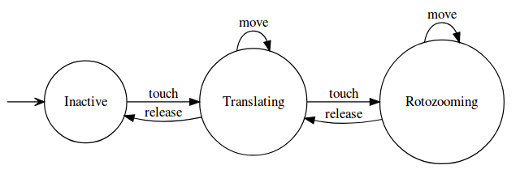

# IHM-MultiTouch

## Membres

* Zoran CHANET
* Servan CHARLOT

## User Interaction Automaton



## Extension: Axis lock
```diff
- This feature has not been implemented. This section describes the changes needed for its implementation
```
This feature would slightly modify the automaton: add a new state, axisLock, which has the same transitions from/to rotozoom as rotozooming's transitions from/to translating. Add a transition from axisLock to axisLock over move event.
* Allow the use of a third click
  * pointerId_3 : number, Pt3_coord_element : SVGPoint, Pt3_coord_parent : SVGPoint
* Implement a rotozoom -> axisLock transition over a touchstart event
  * Compute and save the axis indicated by the 2 first touches (horizontal/vertical)
  * Store the third touch's infos
* Implement an axisLock -> rotozoom transition over a touchend event
  * If the released touch is the first one, consider the third touch as the first
  * If the released touch is the second one, consider the third touch as the second
  * Remove the third touch from the used touches
* Implement an axisLock -> axisLock transition over a touchmove event
  * Act only if the touch moved is the third touch
  * For a picture, actions can be:
    * Zoom according to how much the touch is going away from the axis
  * For a video, actions can be:
    * If the axis is horizontal, turn the volume up/down according to how much the touch is going away from the axis
    * If the axis is vertical, go forward/backward in the video according to how much the touch is going away from the axis
